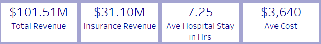
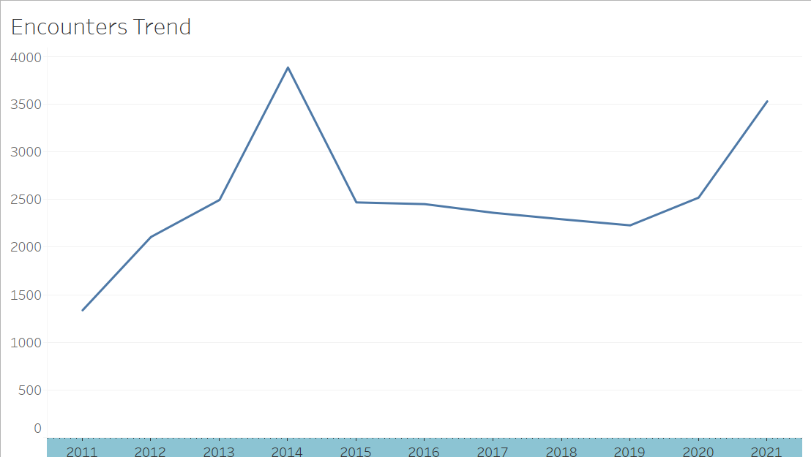
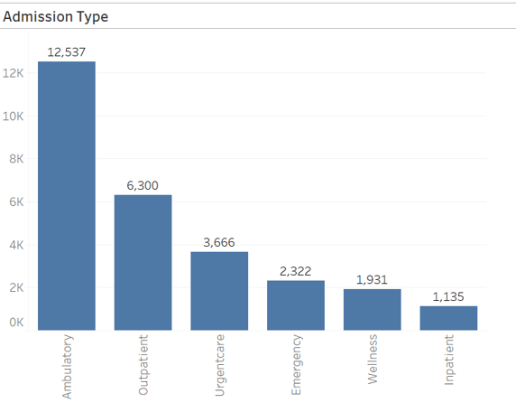
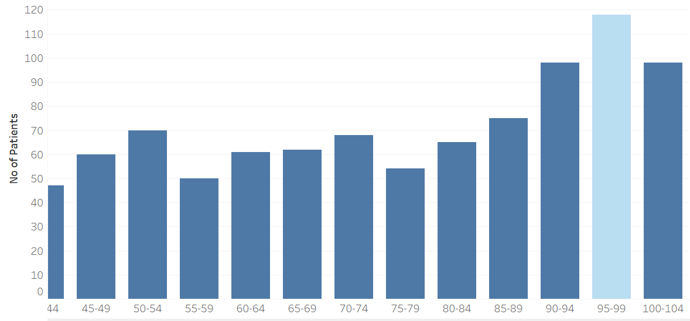
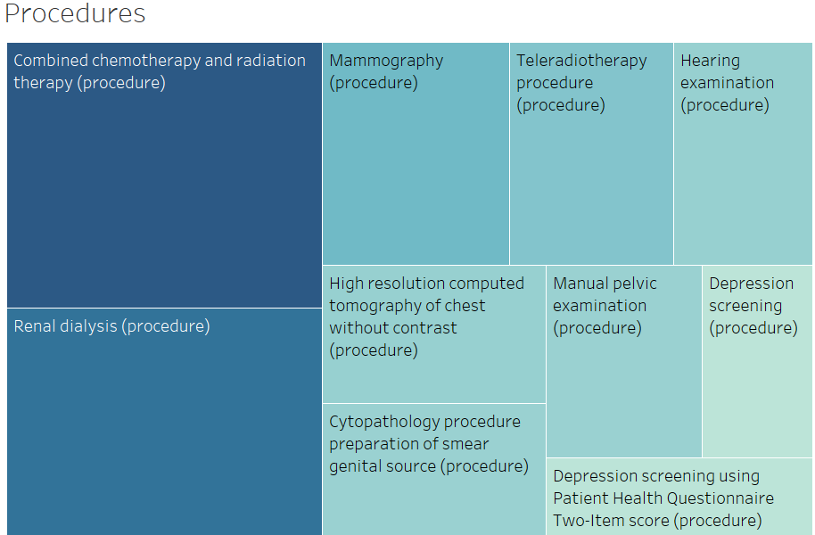
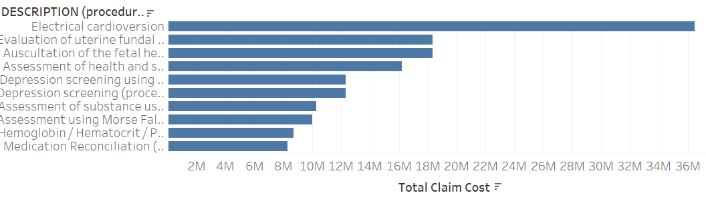
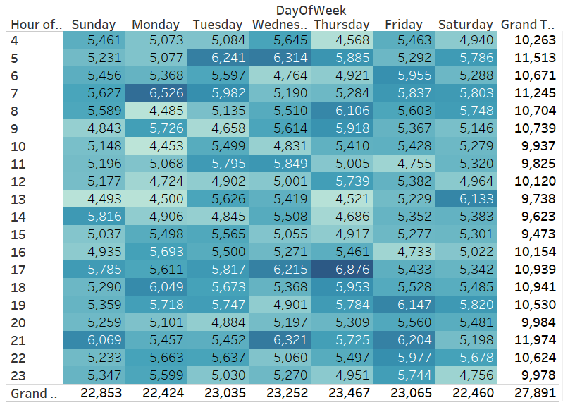
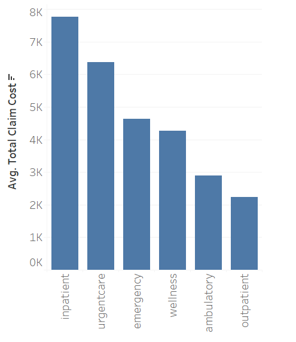
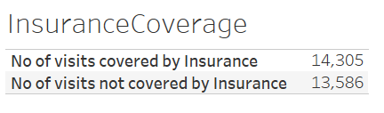
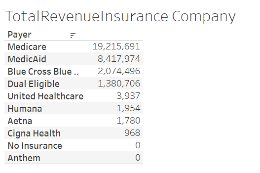

# Executive Summary
This repository consists of 2 projects :\
Project 1: Healthcare Data Integration and Analysis( Data Cleaning and Querying)\
Skillsets: Python, SQL\
Project 2: Hospital Analytics( Data Visualization and Recommendation)\
Skillsets: PowerBI
# Project 1: Healthcare Data Integration and Analysis
This project is about using an Electronic Health Record(EHR) to do the following:\
Identify missing values,duplicate rows,Inconsistent categorical entries\
Fixing missing values, standardize gender values, standardize date values\
Querying patient records with specific conditions like Diabetes 2\
Querying and presenting results from joining tables using SQL\
[Project 1](./Project_Healthcare_Data_Integration_and_Analysis.ipynb)

# Project 2: Hospital Analytics
This repository is an in depth analysis on Massachusetts General Hospital. Part of Data Challenge by Maven Analytics.
This project analyzes hospital operations using Maven Analytics Hospital Challenge. Useful information was extracted from patient encounters, financial claims and patient demographics from Massachussetts Hospital.
Key Metrics include:

    

# Encounters Trend Analysis

    

Patient Encounters peaked at year 2014, approximately 3.8K, followed by a decline. 

# Patient Type Analysis

    

High number of Ambulatory Patients, 12K indicating high reliance on walk in , non emergency cases. Low number of Inpatients, 1K indicating high performance in outpatient services, reducing the need for hospitalization. 
Low inpatient encounters indicate effective preventive care and outpatient management strategies.

# Patient Age Demography

    

The highest age group of the hospital patients is between 95 to 99.

# 10 most Popular Procedures

    

The most popular procedures are chemotherapy and Renal Dialysis.

# 10 most Costly Procedures 

    

The most costly procedure is Electrical cardioversion.

# Busiest Day of the Week

    

Weekdays are busier than weekend for the hospital. Wednesday is the busiest day. Peak hours for patient admissions are 5am, 5 to 10pm. Recommend to increase manpower at peak hours.

# Most Costly Hospital Visits

    

Inpatient and Urgent care have the highest average cost. Recommend to promote outpatient and ambulatory care for non-critical cases to reduce costs.

# Total Insurance Claims by Insurance Providers

    

    

Recommend to Strengthen partnerships with top insurance providers to negotiate better coverage terms.

# Conclusion

The dashboard provides data-driven decision making at Massachussetts General Hospital. By leveraging on insights on patient encounters, financial claim trends, efficiencies in procedures, the hospital can enhance care delivery, manage costs and improve patient outcomes. Futher iterations of the dashboard can incorporate real-time data and predictive analytics to further support strategic planning. 
